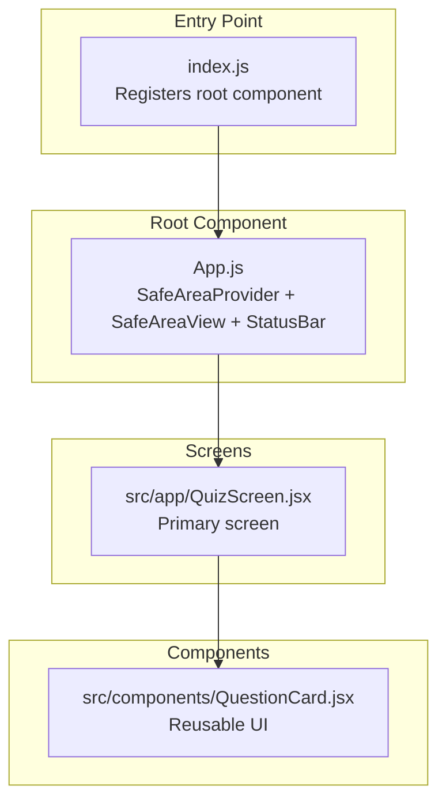
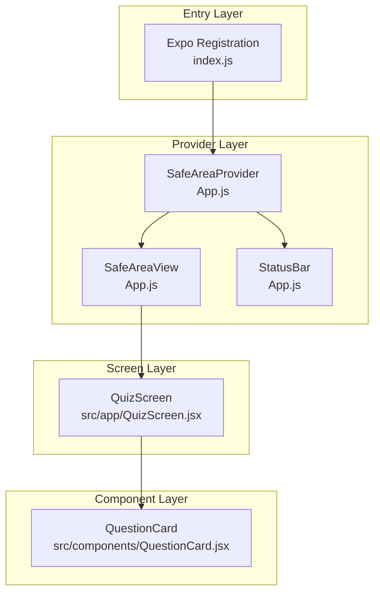
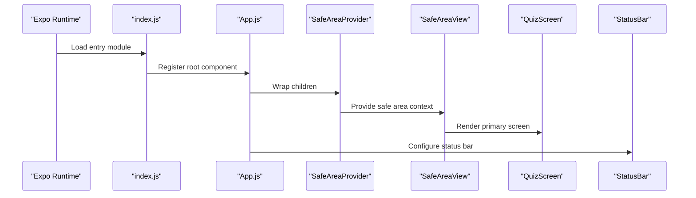
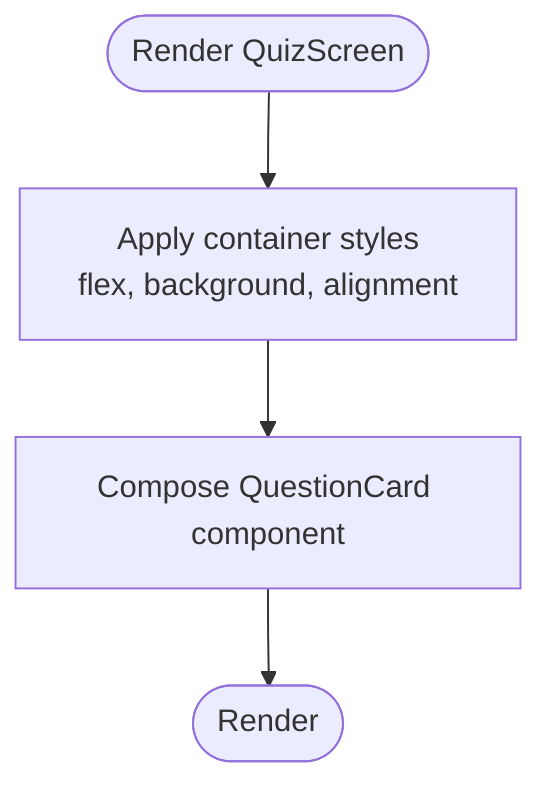
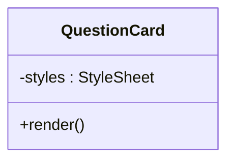
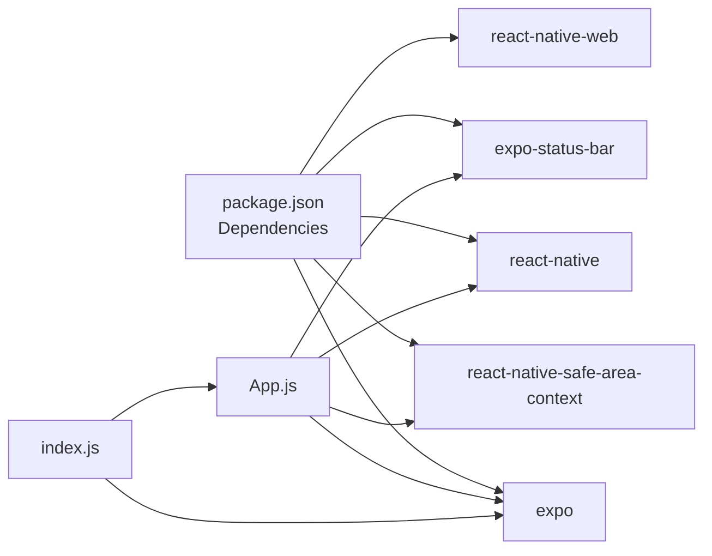

# Application Architecture

<cite>
**Referenced Files in This Document**
- [App.js](file://App.js)
- [index.js](file://index.js)
- [package.json](file://package.json)
- [app.json](file://app.json)
- [src/app/QuizScreen.jsx](file://src/app/QuizScreen.jsx)
- [src/components/QuestionCard.jsx](file://src/components/QuestionCard.jsx)
</cite>

## Table of Contents
1. [Introduction](#introduction)
2. [Project Structure](#project-structure)
3. [Core Components](#core-components)
4. [Architecture Overview](#architecture-overview)
5. [Detailed Component Analysis](#detailed-component-analysis)
6. [Dependency Analysis](#dependency-analysis)
7. [Performance Considerations](#performance-considerations)
8. [Troubleshooting Guide](#troubleshooting-guide)
9. [Conclusion](#conclusion)

## Introduction
This document describes the architectural design of the Quiz Mobile App built with React Native and Expo. The application follows a component-based structure with a clear separation of concerns, utilizing SafeAreaProvider for cross-platform safe area handling and integrating with Expo SDK for unified development across iOS, Android, and Web platforms. The root component initializes providers and renders the primary screen, which composes reusable UI components.

## Project Structure
The project is organized around a minimal yet scalable component hierarchy:
- Application entry point registers the root component with Expo.
- The root component wraps the UI with providers for safe area and status bar integration.
- The primary screen component renders the quiz interface.
- Reusable UI components encapsulate presentation logic.

**Diagram sources**
- [index.js](file://index.js#L1-L9)
- [App.js](file://App.js#L1-L31)
- [src/app/QuizScreen.jsx](file://src/app/QuizScreen.jsx#L1-L11)
- [src/components/QuestionCard.jsx](file://src/components/QuestionCard.jsx#L1-L27)

**Section sources**
- [index.js](file://index.js#L1-L9)
- [App.js](file://App.js#L1-L31)
- [src/app/QuizScreen.jsx](file://src/app/QuizScreen.jsx#L1-L11)
- [src/components/QuestionCard.jsx](file://src/components/QuestionCard.jsx#L1-L27)

## Core Components
- Application entry point: Registers the root component with Expo to bootstrap the app on all platforms.
- Root component: Provides global UI infrastructure including safe area handling and status bar configuration.
- Screen component: Hosts the quiz layout and orchestrates child components.
- UI component: Encapsulates a single presentation unit (question card) with styling.

Key implementation patterns:
- Provider pattern: SafeAreaProvider and SafeAreaView wrap the app to normalize insets across devices.
- Composition pattern: Screens render reusable components to keep views declarative and testable.
- Cross-platform rendering: Expo and React Native Web enable consistent UI on mobile and web.

**Section sources**
- [index.js](file://index.js#L1-L9)
- [App.js](file://App.js#L1-L31)
- [src/app/QuizScreen.jsx](file://src/app/QuizScreen.jsx#L1-L11)
- [src/components/QuestionCard.jsx](file://src/components/QuestionCard.jsx#L1-L27)

## Architecture Overview
The app follows a layered architecture:
- Entry layer: Expo registration and platform initialization.
- Provider layer: Global UI providers for safe areas and status bar.
- Screen layer: Primary screen component orchestrating layout and child components.
- Component layer: Reusable UI components encapsulating presentation.

**Diagram sources**
- [index.js](file://index.js#L1-L9)
- [App.js](file://App.js#L1-L31)
- [src/app/QuizScreen.jsx](file://src/app/QuizScreen.jsx#L1-L11)
- [src/components/QuestionCard.jsx](file://src/components/QuestionCard.jsx#L1-L27)

## Detailed Component Analysis

### Root Component: App.js
Responsibilities:
- Wraps the entire app with SafeAreaProvider to enable safe area-aware layouts.
- Uses SafeAreaView to apply device-specific insets consistently.
- Integrates StatusBar for platform-specific status bar styling.
- Renders the primary screen component and applies top-level styles.

Provider pattern implementation:
- SafeAreaProvider establishes a context for safe area values across the tree.
- SafeAreaView consumes insets and applies padding/margins automatically.
- StatusBar integrates with the OS status bar to adjust contrast and visibility.

**Diagram sources**
- [index.js](file://index.js#L1-L9)
- [App.js](file://App.js#L1-L31)
- [src/app/QuizScreen.jsx](file://src/app/QuizScreen.jsx#L1-L11)

**Section sources**
- [App.js](file://App.js#L1-L31)

### Screen Component: QuizScreen
Responsibilities:
- Defines the primary layout for the quiz experience.
- Centers content and applies background styling.
- Composes reusable UI components to present interactive content.

Composition approach:
- Declarative rendering of child components to keep logic simple and testable.
- Centralized styling for consistent appearance across devices.

**Diagram sources**
- [src/app/QuizScreen.jsx](file://src/app/QuizScreen.jsx#L1-L11)
- [src/components/QuestionCard.jsx](file://src/components/QuestionCard.jsx#L1-L27)

**Section sources**
- [src/app/QuizScreen.jsx](file://src/app/QuizScreen.jsx#L1-L11)

### UI Component: QuestionCard
Responsibilities:
- Presents a single question in a styled card layout.
- Encapsulates typography and spacing for readability.
- Provides a reusable building block for quiz screens.

Styling and structure:
- Self-contained StyleSheet for consistent visuals.
- Rounded corners, shadows, and padding for a modern look.

**Diagram sources**
- [src/components/QuestionCard.jsx](file://src/components/QuestionCard.jsx#L1-L27)

**Section sources**
- [src/components/QuestionCard.jsx](file://src/components/QuestionCard.jsx#L1-L27)

### Application Entry Point: index.js
Responsibilities:
- Registers the root component with Expo to initialize the app runtime.
- Ensures consistent environment setup for both development and production builds.

Integration pattern:
- Uses Expo’s registration utility to bridge React Native and platform-specific environments.

**Section sources**
- [index.js](file://index.js#L1-L9)

## Dependency Analysis
External dependencies and their roles:
- Expo: Provides cross-platform runtime, device APIs, and build pipeline.
- React Native: Core framework for mobile UI components.
- react-native-safe-area-context: Enables safe area handling across devices.
- expo-status-bar: Integrates with the OS status bar.
- react-native-web: Enables web rendering for the same React Native codebase.

Platform support:
- iOS and Android: Native builds via Expo.
- Web: React Native Web rendering with Expo CLI.

**Diagram sources**
- [package.json](file://package.json#L1-L22)
- [App.js](file://App.js#L1-L31)
- [index.js](file://index.js#L1-L9)

**Section sources**
- [package.json](file://package.json#L1-L22)
- [app.json](file://app.json#L1-L30)

## Performance Considerations
- Provider overhead: SafeAreaProvider introduces minimal context updates; ensure it wraps only necessary content.
- Component composition: Keep child components pure and memoized where appropriate to reduce re-renders.
- Styling: Centralize StyleSheet definitions to avoid repeated creation during renders.
- Platform-specific optimizations: Leverage Expo’s new architecture flag and platform-specific settings in app.json for improved startup and rendering.

## Troubleshooting Guide
Common issues and resolutions:
- Safe area not applied: Verify SafeAreaProvider is at the root and SafeAreaView is wrapping the main content.
- Status bar not visible: Confirm StatusBar is included and its style matches the intended theme.
- Web rendering problems: Ensure react-native-web is installed and configured in package.json; test with Expo CLI web target.
- Navigation not working: The current structure does not include navigation; if adding navigation later, ensure it is placed inside the provider context.

**Section sources**
- [App.js](file://App.js#L1-L31)
- [package.json](file://package.json#L1-L22)
- [app.json](file://app.json#L1-L30)

## Conclusion
The Quiz Mobile App employs a clean, component-based architecture with a strong emphasis on cross-platform compatibility and safe area handling. The root component initializes providers and status bar integration, while the primary screen composes reusable UI components. This structure enables scalability, maintainability, and consistent user experiences across iOS, Android, and Web platforms.