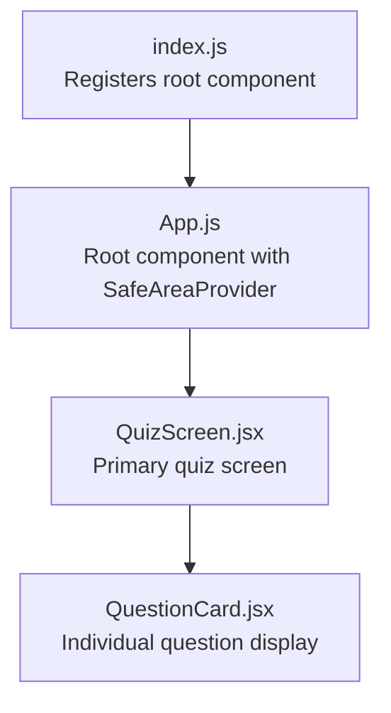
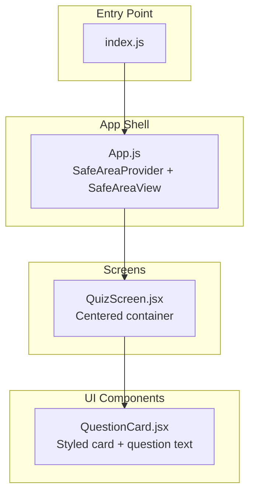
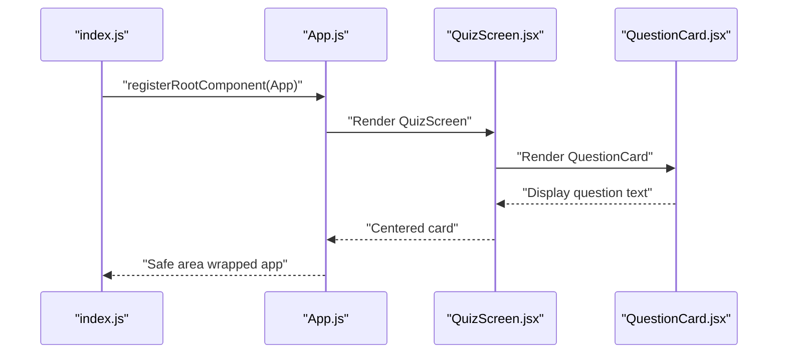
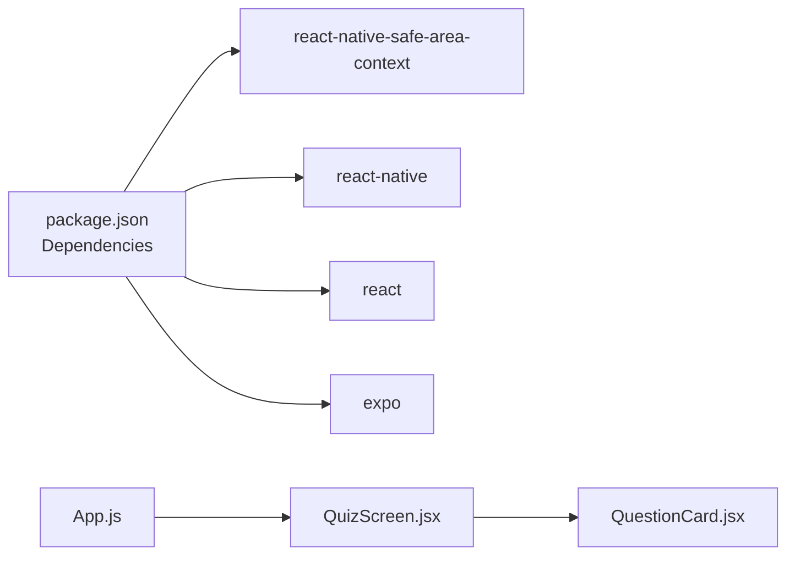

# Core Components

<cite>
**Referenced Files in This Document**
- [App.js](file://App.js)
- [QuizScreen.jsx](file://src/app/QuizScreen.jsx)
- [QuestionCard.jsx](file://src/components/QuestionCard.jsx)
- [index.js](file://index.js)
- [package.json](file://package.json)
- [app.json](file://app.json)
</cite>

## Table of Contents
1. [Introduction](#introduction)
2. [Project Structure](#project-structure)
3. [Core Components](#core-components)
4. [Architecture Overview](#architecture-overview)
5. [Detailed Component Analysis](#detailed-component-analysis)
6. [Dependency Analysis](#dependency-analysis)
7. [Performance Considerations](#performance-considerations)
8. [Troubleshooting Guide](#troubleshooting-guide)
9. [Conclusion](#conclusion)

## Introduction
This document explains the core components of the Quiz Mobile App, focusing on the root application entry, the primary quiz screen, and the individual question card component. It covers component composition, props and state patterns, styling approaches, user interaction considerations, and integration with React Native’s SafeAreaView. Practical examples demonstrate how components relate and how to customize them for real-world usage.

## Project Structure
The project follows a minimal React Native structure with an entry point, a root component that wraps the app in safe area providers, and two primary UI components: a quiz screen and a reusable question card.

**Diagram sources**
- [index.js](file://index.js#L1-L9)
- [App.js](file://App.js#L1-L31)
- [QuizScreen.jsx](file://src/app/QuizScreen.jsx#L1-L11)
- [QuestionCard.jsx](file://src/components/QuestionCard.jsx#L1-L28)

**Section sources**
- [index.js](file://index.js#L1-L9)
- [App.js](file://App.js#L1-L31)
- [QuizScreen.jsx](file://src/app/QuizScreen.jsx#L1-L11)
- [QuestionCard.jsx](file://src/components/QuestionCard.jsx#L1-L28)
- [package.json](file://package.json#L1-L22)
- [app.json](file://app.json#L1-L30)

## Core Components
- Root Application Component (App.js): Provides the global safe area provider and wraps the main content in a safe area view. It renders the quiz screen and the status bar.
- Quiz Screen (QuizScreen.jsx): Hosts the question card with centered layout and background styling.
- Question Card (QuestionCard.jsx): Displays a single question inside a styled card with padding, rounded corners, and shadow.

Key characteristics:
- Composition: App.js -> QuizScreen -> QuestionCard
- Styling: Uses StyleSheet for consistent, cross-platform styles.
- Safe Area Integration: Uses SafeAreaProvider and SafeAreaView to handle device insets safely.

Practical usage examples:
- To change the background color of the quiz screen, modify the container style in QuizScreen.jsx.
- To adjust question text, update the Text element inside QuestionCard.jsx.
- To add interactivity, wrap QuestionCard with buttons or touchables and pass handlers via props.

**Section sources**
- [App.js](file://App.js#L9-L21)
- [QuizScreen.jsx](file://src/app/QuizScreen.jsx#L3-L10)
- [QuestionCard.jsx](file://src/components/QuestionCard.jsx#L3-L9)

## Architecture Overview
The app initializes through index.js, which registers the root component. App.js sets up the safe area context and renders the quiz screen. QuizScreen centers the question card and applies background styling. QuestionCard encapsulates the question presentation with its own styles.

**Diagram sources**
- [index.js](file://index.js#L1-L9)
- [App.js](file://App.js#L9-L21)
- [QuizScreen.jsx](file://src/app/QuizScreen.jsx#L3-L10)
- [QuestionCard.jsx](file://src/components/QuestionCard.jsx#L3-L9)

## Detailed Component Analysis

### App.js Root Component
Responsibilities:
- Provides SafeAreaProvider to enable safe area-aware layouts.
- Wraps the main content in SafeAreaView to respect device notches and insets.
- Renders the quiz screen and the status bar.

Props and state:
- No props required at this level.
- No internal state in the root component.

Styling and layout:
- Container uses flex to fill available space.
- Background color is set on the outer SafeAreaView to ensure full coverage behind content.

Integration with SafeAreaView:
- SafeAreaView is configured with a black background to prevent content visibility behind notches.
- SafeAreaProvider enables downstream components to consume safe area insets.

Lifecycle and rendering:
- Stateless functional component; renders once during initial mount.
- Ensures the quiz screen is rendered within a safe area context.

Customization examples:
- Change the SafeAreaView background color to match branding.
- Add top/bottom bars or navigation elements around the quiz screen.

**Section sources**
- [App.js](file://App.js#L9-L21)
- [App.js](file://App.js#L23-L30)

### QuizScreen.jsx Primary Screen
Responsibilities:
- Centers the question card on the screen.
- Applies background styling to the screen container.
- Serves as the host for interactive quiz elements (buttons, progress indicators) in future iterations.

Props and state:
- No props required currently.
- No internal state in this component.

Layout and styling:
- Flexbox centering aligns the card vertically and horizontally.
- Padding around the card improves readability and spacing.

Interaction patterns:
- Intended to host user actions (e.g., answer selection) and navigation between questions.

Customization examples:
- Adjust padding and alignment to support multiple cards or dynamic content.
- Add header/footer areas for score or timer.

**Section sources**
- [QuizScreen.jsx](file://src/app/QuizScreen.jsx#L3-L10)

### QuestionCard.jsx Individual Question Display
Responsibilities:
- Presents a single question inside a visually distinct card.
- Encapsulates question text styling and card appearance.

Props and state:
- No props required currently.
- No internal state in this component.

Styling and layout:
- Card-like container with padding, rounded corners, and shadow/elevation for depth.
- Question text styled with font size and weight.

Interaction patterns:
- Can be wrapped with pressable elements to enable selection or reveal answers.
- Can accept handlers via props to integrate with parent screens.

Customization examples:
- Pass question text as a prop to render dynamic content.
- Add action buttons (e.g., “Next”, “Reveal Answer”) inside the card.

**Section sources**
- [QuestionCard.jsx](file://src/components/QuestionCard.jsx#L3-L9)
- [QuestionCard.jsx](file://src/components/QuestionCard.jsx#L10-L28)

### Component Composition and Data Flow
Composition:
- App.js provides the safe area context and renders QuizScreen.
- QuizScreen renders QuestionCard.
- QuestionCard displays static question text.

Data flow:
- Current implementation is read-only; data can be introduced via props passed from parent screens.
- Future enhancements can include state updates for selected answers and navigation to subsequent questions.

**Diagram sources**
- [index.js](file://index.js#L1-L9)
- [App.js](file://App.js#L9-L21)
- [QuizScreen.jsx](file://src/app/QuizScreen.jsx#L3-L10)
- [QuestionCard.jsx](file://src/components/QuestionCard.jsx#L3-L9)

## Dependency Analysis
External dependencies:
- react-native-safe-area-context: Enables SafeAreaProvider and SafeAreaView.
- expo, react-native, react: Core framework dependencies.
- expo-status-bar: Controls status bar appearance.

Internal dependencies:
- App.js depends on QuizScreen.
- QuizScreen depends on QuestionCard.

**Diagram sources**
- [package.json](file://package.json#L11-L19)
- [App.js](file://App.js#L1-L4)
- [QuizScreen.jsx](file://src/app/QuizScreen.jsx#L1-L2)
- [QuestionCard.jsx](file://src/components/QuestionCard.jsx#L1)

**Section sources**
- [package.json](file://package.json#L11-L19)
- [App.js](file://App.js#L1-L4)
- [QuizScreen.jsx](file://src/app/QuizScreen.jsx#L1-L2)
- [QuestionCard.jsx](file://src/components/QuestionCard.jsx#L1)

## Performance Considerations
- Keep components stateless where possible to reduce re-renders.
- Use StyleSheet for styles to leverage native performance benefits.
- Avoid unnecessary re-renders by passing stable references for event handlers.
- Consider extracting QuestionCard into a memoized component if props become dynamic.

## Troubleshooting Guide
Common issues and resolutions:
- Safe area not respected: Ensure SafeAreaProvider is at the root and SafeAreaView wraps main content.
- Content hidden behind notches: Verify SafeAreaView background color and inset handling.
- Styles not applying: Confirm StyleSheet keys are correctly referenced and not overwritten by inline styles.

**Section sources**
- [App.js](file://App.js#L12-L19)
- [QuestionCard.jsx](file://src/components/QuestionCard.jsx#L10-L28)

## Conclusion
The Quiz Mobile App’s core components form a clean, modular foundation: App.js establishes a safe area-aware shell, QuizScreen centers and hosts the quiz content, and QuestionCard encapsulates the question presentation. The current implementation is read-only and serves as a starting point for adding interactivity, dynamic data, and navigation. By leveraging props, state, and StyleSheet, developers can extend the components to support a full quiz experience while maintaining consistent styling and safe area compliance.