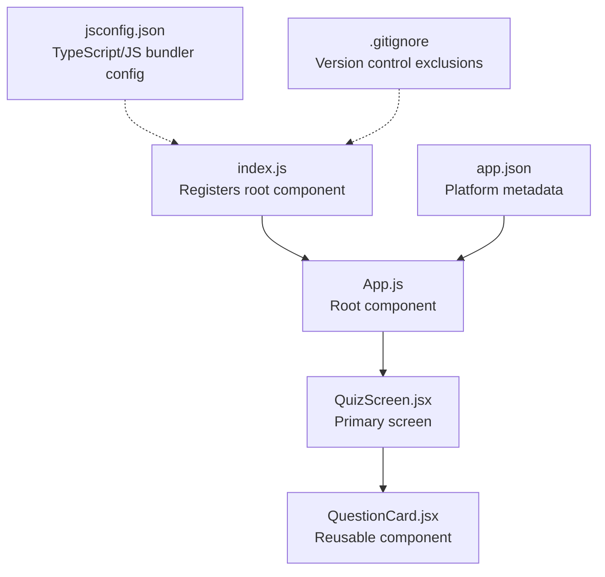
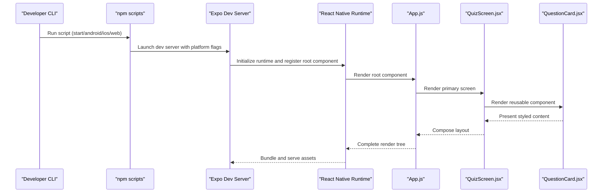
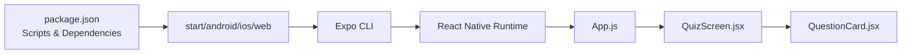

# Development Workflow

<cite>
**Referenced Files in This Document**
- [package.json](file://package.json)
- [jsconfig.json](file://jsconfig.json)
- [.gitignore](file://.gitignore)
- [App.js](file://App.js)
- [index.js](file://index.js)
- [app.json](file://app.json)
- [src/app/QuizScreen.jsx](file://src/app/QuizScreen.jsx)
- [src/components/QuestionCard.jsx](file://src/components/QuestionCard.jsx)
</cite>

## Table of Contents
1. [Introduction](#introduction)
2. [Project Structure](#project-structure)
3. [Core Components](#core-components)
4. [Architecture Overview](#architecture-overview)
5. [Detailed Component Analysis](#detailed-component-analysis)
6. [Dependency Analysis](#dependency-analysis)
7. [Performance Considerations](#performance-considerations)
8. [Troubleshooting Guide](#troubleshooting-guide)
9. [Conclusion](#conclusion)
10. [Appendices](#appendices)

## Introduction
This document describes the development workflow and project maintenance practices for the Quiz Mobile App. It explains the npm scripts used during development, the JavaScript configuration impacting the development experience, the version control exclusions, and best practices for organizing components, writing tests, debugging, optimizing performance, preparing for deployment, and extending the application while preserving architectural patterns. The project is built with Expo and React Native, and the current structure centers around a single screen and a reusable component.

## Project Structure
The project follows a conventional Expo + React Native layout:
- Root entry registers the application component.
- The main application component wraps the UI with safe area providers and renders the primary screen.
- The primary screen composes reusable components.
- Configuration files define platform metadata, bundler behavior, and version control exclusions.

**Diagram sources**
- [index.js](file://index.js#L1-L9)
- [App.js](file://App.js#L1-L31)
- [src/app/QuizScreen.jsx](file://src/app/QuizScreen.jsx#L1-L11)
- [src/components/QuestionCard.jsx](file://src/components/QuestionCard.jsx#L1-L28)
- [app.json](file://app.json#L1-L30)
- [jsconfig.json](file://jsconfig.json#L1-L17)
- [.gitignore](file://.gitignore#L1-L42)

**Section sources**
- [index.js](file://index.js#L1-L9)
- [App.js](file://App.js#L1-L31)
- [src/app/QuizScreen.jsx](file://src/app/QuizScreen.jsx#L1-L11)
- [src/components/QuestionCard.jsx](file://src/components/QuestionCard.jsx#L1-L28)
- [app.json](file://app.json#L1-L30)
- [jsconfig.json](file://jsconfig.json#L1-L17)
- [.gitignore](file://.gitignore#L1-L42)

## Core Components
- Application registration: The root component is registered via the Expo entry mechanism.
- Root component: Provides safe area handling and renders the primary screen with a status bar.
- Primary screen: Hosts the quiz content and composes reusable components.
- Reusable component: A presentational card displaying a question with styled text.

Key responsibilities:
- index.js delegates initialization to the Expo runtime.
- App.js centralizes layout and provider setup.
- QuizScreen.jsx orchestrates content layout.
- QuestionCard.jsx encapsulates presentation and styling.

**Section sources**
- [index.js](file://index.js#L1-L9)
- [App.js](file://App.js#L1-L31)
- [src/app/QuizScreen.jsx](file://src/app/QuizScreen.jsx#L1-L11)
- [src/components/QuestionCard.jsx](file://src/components/QuestionCard.jsx#L1-L28)

## Architecture Overview
The runtime flow connects the entry point to the UI composition and platform configuration.

**Diagram sources**
- [package.json](file://package.json#L5-L10)
- [index.js](file://index.js#L1-L9)
- [App.js](file://App.js#L1-L31)
- [src/app/QuizScreen.jsx](file://src/app/QuizScreen.jsx#L1-L11)
- [src/components/QuestionCard.jsx](file://src/components/QuestionCard.jsx#L1-L28)

## Detailed Component Analysis

### Application Entry and Registration
- Purpose: Registers the root component with the Expo runtime to bootstrap the app in all environments (Expo Go, Android, iOS, Web).
- Behavior: Delegates to the Expo registration utility, ensuring consistent environment setup across platforms.

Best practices:
- Keep the registration minimal and centralized.
- Avoid heavy logic here; defer to the root component.

**Section sources**
- [index.js](file://index.js#L1-L9)

### Root Component (App)
- Purpose: Wraps the UI with safe area providers and renders the primary screen.
- Providers: Uses safe area context providers to handle device insets.
- Layout: Centers the primary screen and applies a base container style.

Best practices:
- Centralize cross-cutting concerns (status bar, safe areas) here.
- Keep styles scoped and avoid deep nesting.

**Section sources**
- [App.js](file://App.js#L1-L31)

### Primary Screen (QuizScreen)
- Purpose: Hosts the quiz content and composes reusable components.
- Composition: Renders the QuestionCard component.

Best practices:
- Use semantic names for screens and keep them focused.
- Pass props explicitly to child components for clarity.

**Section sources**
- [src/app/QuizScreen.jsx](file://src/app/QuizScreen.jsx#L1-L11)

### Reusable Component (QuestionCard)
- Purpose: Presents a single question with styled text.
- Styling: Uses StyleSheet for performance and consistency.
- Encapsulation: Self-contained rendering logic.

Best practices:
- Extract constants into styles for reuse.
- Keep presentational components dumb; move logic to parent screens.

**Section sources**
- [src/components/QuestionCard.jsx](file://src/components/QuestionCard.jsx#L1-L28)

### Platform Metadata (app.json)
- Purpose: Defines app metadata, icons, splash, platform-specific settings, and web configuration.
- Notable fields: Name, slug, version, orientation, adaptive icon, edge-to-edge support, and web favicon.

Best practices:
- Keep platform settings aligned with the app’s branding and UX guidelines.
- Update version and slug carefully during releases.

**Section sources**
- [app.json](file://app.json#L1-L30)

### JavaScript Configuration (jsconfig.json)
- Purpose: Configures the bundler and TypeScript/JS strictness for the project.
- Compiler options: Module system, resolution strategy, target, JSX transform, strict checks, and casing enforcement.
- Exclusions: Skips node_modules and nested module folders.

Impact on development:
- Enforces stricter type checking and function typing.
- Improves editor support and reduces runtime errors.
- Prevents bundling of excluded directories.

**Section sources**
- [jsconfig.json](file://jsconfig.json#L1-L17)

### Version Control Exclusions (.gitignore)
- Purpose: Prevents committing unnecessary or sensitive files to version control.
- Categories: Dependencies, Expo artifacts, native build outputs, Metro health checks, debug logs, OS-specific files, local environment overrides, TypeScript build info, and generated native folders.

Best practices:
- Keep .gitignore updated as new tooling generates new artifacts.
- Add secrets and local overrides to .gitignore to prevent accidental commits.

**Section sources**
- [.gitignore](file://.gitignore#L1-L42)

## Dependency Analysis
The project relies on Expo and React Native ecosystems. The npm scripts delegate to the Expo CLI for platform-specific development servers.

**Diagram sources**
- [package.json](file://package.json#L5-L10)
- [index.js](file://index.js#L1-L9)
- [App.js](file://App.js#L1-L31)
- [src/app/QuizScreen.jsx](file://src/app/QuizScreen.jsx#L1-L11)
- [src/components/QuestionCard.jsx](file://src/components/QuestionCard.jsx#L1-L28)

**Section sources**
- [package.json](file://package.json#L1-L22)

## Performance Considerations
- Prefer StyleSheet over inline styles for better caching and rendering performance.
- Keep components small and focused; split large components into smaller, reusable pieces.
- Avoid unnecessary re-renders by passing stable references and using memoization where appropriate.
- Use edge-to-edge and adaptive icons for modern platform experiences.
- Leverage safe area providers to prevent layout thrashing on devices with notches or gesture areas.

[No sources needed since this section provides general guidance]

## Troubleshooting Guide
Common development issues and resolutions:
- Metro bundler errors: Clear cache and reinstall dependencies if builds fail unexpectedly.
- Platform-specific issues: Use the dedicated scripts to launch the intended platform and ensure device/emulator connectivity.
- Asset loading problems: Verify asset paths and ensure assets are placed under the assets directory referenced by app.json.
- Editor diagnostics: Ensure jsconfig.json is recognized by your editor to benefit from strict checks and auto-completion.

**Section sources**
- [package.json](file://package.json#L5-L10)
- [jsconfig.json](file://jsconfig.json#L1-L17)
- [app.json](file://app.json#L1-L30)

## Conclusion
The Quiz Mobile App follows a clean, minimal structure leveraging Expo and React Native. By adhering to the established patterns—centralized registration, provider-wrapped root component, modular screens, and reusable components—you can extend functionality reliably. Use the npm scripts for quick iteration across platforms, maintain strict JS configuration for better developer experience, and keep .gitignore updated to streamline collaboration and CI/CD pipelines.

[No sources needed since this section summarizes without analyzing specific files]

## Appendices

### Development Scripts Reference
- start: Launches the Expo development server.
- android: Starts the development server targeting Android.
- ios: Starts the development server targeting iOS.
- web: Starts the development server targeting the web platform.

Usage:
- Run the desired script to open the Expo DevTools and preview the app on your chosen platform.

**Section sources**
- [package.json](file://package.json#L5-L10)

### Code Organization Best Practices
- Feature-based grouping: Place related screens and components under feature folders when the app grows.
- Naming conventions: Use PascalCase for components and kebab-case for files.
- Props contracts: Define clear prop interfaces for components to improve readability and reduce bugs.
- Styles: Centralize shared styles and reuse constants across components.

[No sources needed since this section provides general guidance]

### Testing Strategies
- Unit tests: Test pure functions and component logic using a lightweight test runner.
- Component tests: Snapshot or shallow-render components to catch regressions.
- Integration tests: Validate screen compositions and navigation flows.
- Platform parity: Test on Android, iOS, and Web to catch platform-specific issues early.

[No sources needed since this section provides general guidance]

### Debugging Approaches
- Console logging: Use console.debug/log/warn/error strategically.
- React DevTools: Inspect component trees and props/state.
- Expo DevTools: Use the in-app controls to reload, toggle dev mode, and inspect network requests.
- Platform-specific tools: Use Flipper, Safari Web Inspector (iOS), Chrome DevTools (Android), or browser devtools (web).

[No sources needed since this section provides general guidance]

### Deployment Preparation
- Clean builds: Remove generated artifacts and caches before building.
- Assets: Ensure all assets referenced in app.json and components are present.
- Versioning: Update app version and slug in app.json for release builds.
- Platform builds: Generate native binaries and web bundles using Expo EAS or Expo Web build pipelines.

[No sources needed since this section provides general guidance]

### Extending the Application
- Add new screens under src/app and compose them in the root component.
- Create reusable components under src/components and export default functions.
- Introduce navigation using a routing library compatible with Expo and React Navigation.
- Maintain consistent styling via StyleSheet and shared constants.

[No sources needed since this section provides general guidance]