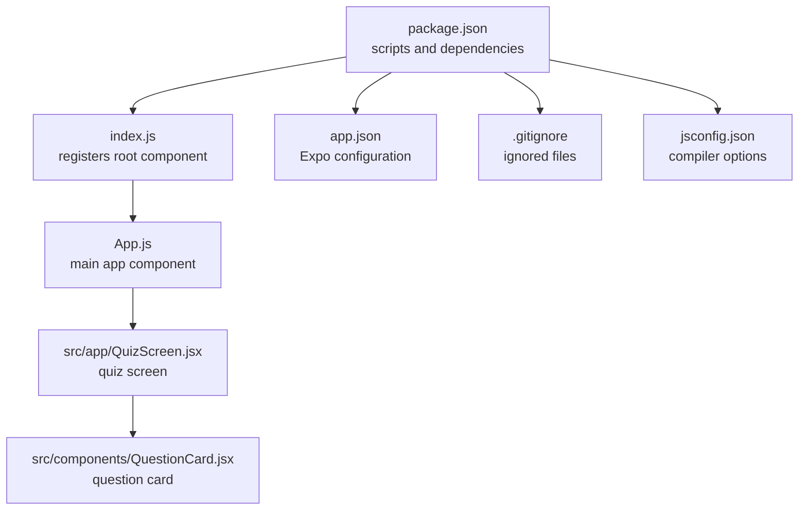
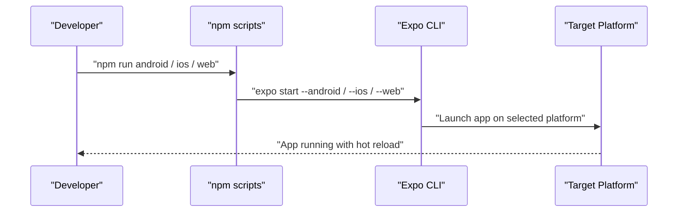

# Getting Started

<cite>
**Referenced Files in This Document**
- [package.json](file://package.json)
- [app.json](file://app.json)
- [index.js](file://index.js)
- [App.js](file://App.js)
- [src/app/QuizScreen.jsx](file://src/app/QuizScreen.jsx)
- [src/components/QuestionCard.jsx](file://src/components/QuestionCard.jsx)
- [jsconfig.json](file://jsconfig.json)
- [.gitignore](file://.gitignore)
</cite>

## Table of Contents
1. [Introduction](#introduction)
2. [Prerequisites](#prerequisites)
3. [Installation](#installation)
4. [Development Workflow](#development-workflow)
5. [Project Structure](#project-structure)
6. [Running on Different Platforms](#running-on-different-platforms)
7. [Verification Steps](#verification-steps)
8. [Troubleshooting](#troubleshooting)
9. [Conclusion](#conclusion)

## Introduction
This guide helps you set up and run the Quiz Mobile App locally. The project is built with React Native and managed by Expo, enabling cross-platform development for iOS, Android, and Web. You will learn how to prepare your environment, install dependencies, start the development server, and run the app on various platforms.

## Prerequisites
Before installing the app, ensure your system meets the following requirements:

- Operating system:
  - Windows, macOS, or Linux
- Node.js:
  - Install a recent LTS version of Node.js (18.x or newer recommended). Verify installation with:
    ```
    node --version
    ```
- Package manager:
  - npm (comes with Node.js) or Yarn. Verify with:
    ```
    npm --version
    yarn --version
    ```
- Expo CLI:
  - Install globally for convenient development commands:
    ```
    npm install -g @expo/cli
    ```
  - Verify installation:
    ```
    expo --version
    ```

Platform-specific requirements:
- Android:
  - Android Studio with Android SDK and an emulator or a physical Android device connected via USB debugging.
  - Enable Developer Options and USB Debugging on your device.
- iOS:
  - macOS with Xcode installed.
  - An iOS simulator or a physical iOS device registered in Xcode.
- Web:
  - Modern web browser (Chrome, Safari, Firefox, Edge).

Optional developer tools:
- VS Code or another editor with React Native extensions for JSX editing.
- Expo Go app on your mobile device for quick testing during development.

**Section sources**
- [package.json](file://package.json#L1-L22)
- [app.json](file://app.json#L1-L30)

## Installation
Follow these steps to install and prepare the project:

1. Clone or download the repository to your machine.
2. Open a terminal in the project root directory.
3. Install dependencies:
   ```
   npm install
   ```
   This reads the dependencies from package.json and installs them locally.

4. Verify the installation:
   - Confirm that node_modules was created.
   - Confirm that package-lock.json exists.

5. Optional: Initialize the project with Expo if needed:
   - Run:
     ```
     npx expo install
     ```
   - This ensures compatible versions of Expo packages are installed.

6. Configure your IDE:
   - Open jsconfig.json to benefit from strict JavaScript settings and JSX support.

**Section sources**
- [package.json](file://package.json#L1-L22)
- [jsconfig.json](file://jsconfig.json#L1-L17)

## Development Workflow
The project uses Expo to manage development and deployment. Here’s how to develop locally:

1. Start the development server:
   ```
   npm start
   ```
   This runs the Expo CLI and opens the development menu in your terminal and a QR code in your browser.

2. Choose a target platform:
   - Scan the QR code with the Expo Go app on your phone to run on iOS or Android.
   - Or select “Run on Android” or “Run on iOS” from the development menu to launch the respective simulator/emulator.
   - Select “Run on Web” to open the app in a browser.

3. Hot reload:
   - While the development server is running, changes to your source files trigger automatic reload in the app.

4. Stop the server:
   - Press q in the terminal to quit the development server.

5. Platform-specific commands:
   - Android:
     ```
     npm run android
     ```
   - iOS:
     ```
     npm run ios
     ```
   - Web:
     ```
     npm run web
     ```

6. Build for production (optional):
   - Use the Expo CLI to build native binaries or a static web site:
     ```
     expo build:android
     expo build:ios
     expo export --platform web
     ```

**Section sources**
- [package.json](file://package.json#L5-L10)
- [index.js](file://index.js#L1-L9)
- [App.js](file://App.js#L1-L31)

## Project Structure
Understanding the project layout helps you navigate and modify the app:

- Root-level files:
  - package.json: Defines scripts, dependencies, and metadata for the project.
  - app.json: Expo configuration including app name, icons, splash screen, platform-specific settings, and web settings.
  - index.js: Registers the root component with Expo.
  - App.js: The main application component that renders the QuizScreen and wraps it in safe areas and status bar.
  - jsconfig.json: Compiler options for JavaScript/JSX.
  - .gitignore: Ignores node_modules, Expo cache, native build artifacts, and logs.

- Source code:
  - src/app/QuizScreen.jsx: Renders the quiz interface and includes QuestionCard.
  - src/components/QuestionCard.jsx: Displays a sample question card with styling.



**Diagram sources**
- [package.json](file://package.json#L1-L22)
- [index.js](file://index.js#L1-L9)
- [App.js](file://App.js#L1-L31)
- [src/app/QuizScreen.jsx](file://src/app/QuizScreen.jsx#L1-L11)
- [src/components/QuestionCard.jsx](file://src/components/QuestionCard.jsx#L1-L27)
- [app.json](file://app.json#L1-L30)
- [.gitignore](file://.gitignore#L1-L42)
- [jsconfig.json](file://jsconfig.json#L1-L17)

**Section sources**
- [package.json](file://package.json#L1-L22)
- [app.json](file://app.json#L1-L30)
- [index.js](file://index.js#L1-L9)
- [App.js](file://App.js#L1-L31)
- [src/app/QuizScreen.jsx](file://src/app/QuizScreen.jsx#L1-L11)
- [src/components/QuestionCard.jsx](file://src/components/QuestionCard.jsx#L1-L27)
- [jsconfig.json](file://jsconfig.json#L1-L17)
- [.gitignore](file://.gitignore#L1-L42)

## Running on Different Platforms
You can run the app on multiple platforms using the scripts defined in package.json:

- Android:
  - Command: npm run android
  - Requires Android Studio and an emulator/device configured.
- iOS:
  - Command: npm run ios
  - Requires Xcode and an iOS simulator/device configured.
- Web:
  - Command: npm run web
  - Opens the app in a browser.

The development server automatically detects your platform selection and launches the appropriate runtime.



**Diagram sources**
- [package.json](file://package.json#L5-L10)

**Section sources**
- [package.json](file://package.json#L5-L10)

## Verification Steps
After installation and running the app, verify everything works:

- App loads:
  - On iOS/Android via Expo Go, you should see the main screen with a centered question card.
  - On Web, the browser should display the same screen.
- Hot reload:
  - Edit a JSX file (for example, change text in src/components/QuestionCard.jsx) and save. The app should update immediately.
- Scripts:
  - npm start, npm run android, npm run ios, npm run web should all execute without errors.
- Expo configuration:
  - Icons, splash screen, and platform settings in app.json should render correctly.

**Section sources**
- [App.js](file://App.js#L1-L31)
- [src/app/QuizScreen.jsx](file://src/app/QuizScreen.jsx#L1-L11)
- [src/components/QuestionCard.jsx](file://src/components/QuestionCard.jsx#L1-L27)
- [app.json](file://app.json#L1-L30)

## Troubleshooting
Common setup issues and fixes:

- Node.js or npm not found:
  - Ensure Node.js is installed and added to PATH. Reopen your terminal after installation.
  - Verify with node --version and npm --version.
- Permission denied when installing:
  - On Unix-like systems, use sudo or fix permissions for your npm prefix.
- Port conflicts:
  - The development server may fail to bind to a port. Close other apps using ports 19000–19001 or configure a different port via environment variables.
- Android emulator not detected:
  - Start an emulator manually in Android Studio or connect a physical device. Ensure ADB recognizes the device.
- iOS simulator not detected:
  - Launch Xcode and accept license agreements. Ensure a simulator is available in Xcode > Window > Devices and Simulators.
- Web browser not opening:
  - Manually open http://localhost:19006 in your browser after running npm start.
- Missing Expo Go on device:
  - Download the Expo Go app from the App Store (iOS) or Google Play Store (Android).
- Dependencies not installing:
  - Clear npm cache and retry:
    ```
    npm cache clean --force
    rm -rf node_modules package-lock.json
    npm install
    ```
- Conflicts with global Expo CLI:
  - Prefer npx expo commands or install @expo/cli globally:
    ```
    npm install -g @expo/cli
    ```

**Section sources**
- [package.json](file://package.json#L1-L22)
- [app.json](file://app.json#L1-L30)

## Conclusion
You now have the fundamentals to install, run, and iterate on the Quiz Mobile App across iOS, Android, and Web. Use the provided scripts to start the development server, scan the QR code with Expo Go, or run platform-specific commands. If you encounter issues, refer to the troubleshooting section and verify your environment against the prerequisites.