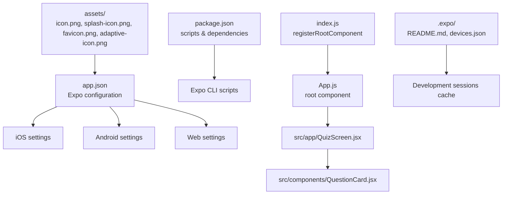
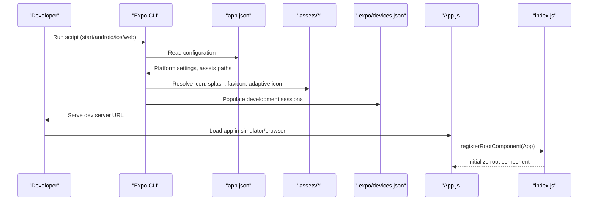
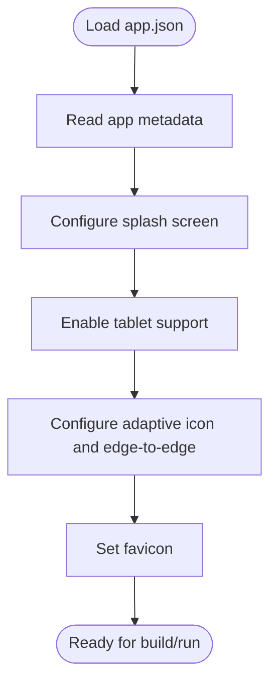
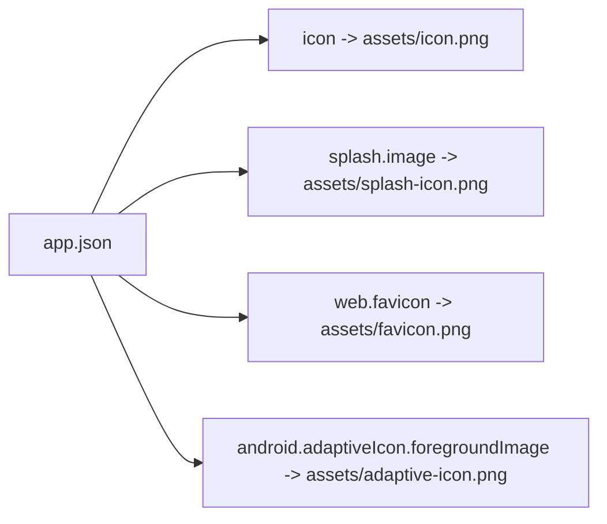
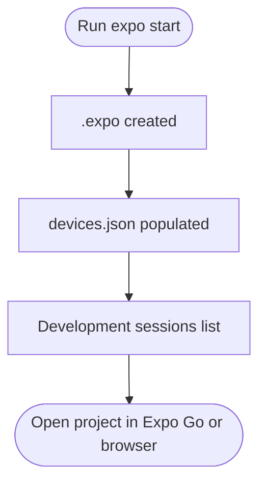
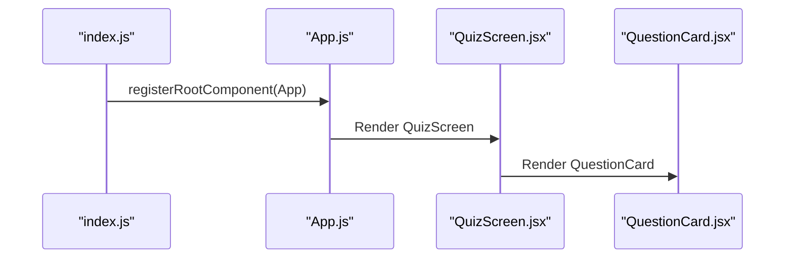
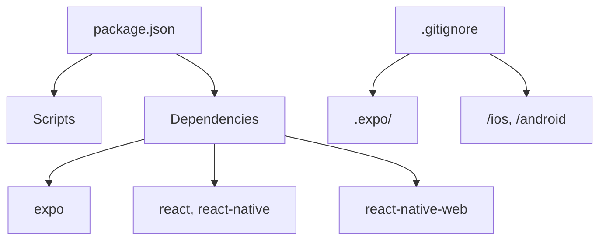

# Platform Configuration

<cite>
**Referenced Files in This Document**
- [app.json](file://app.json)
- [package.json](file://package.json)
- [index.js](file://index.js)
- [App.js](file://App.js)
- [.expo/README.md](file://.expo/README.md)
- [.expo/devices.json](file://.expo/devices.json)
- [assets/icon.png](file://assets/icon.png)
- [assets/splash-icon.png](file://assets/splash-icon.png)
- [assets/favicon.png](file://assets/favicon.png)
- [assets/adaptive-icon.png](file://assets/adaptive-icon.png)
- [src/app/QuizScreen.jsx](file://src/app/QuizScreen.jsx)
- [src/components/QuestionCard.jsx](file://src/components/QuestionCard.jsx)
- [.gitignore](file://.gitignore)
</cite>

## Table of Contents
1. [Introduction](#introduction)
2. [Project Structure](#project-structure)
3. [Core Components](#core-components)
4. [Architecture Overview](#architecture-overview)
5. [Detailed Component Analysis](#detailed-component-analysis)
6. [Dependency Analysis](#dependency-analysis)
7. [Performance Considerations](#performance-considerations)
8. [Troubleshooting Guide](#troubleshooting-guide)
9. [Conclusion](#conclusion)

## Introduction
This document explains the platform configuration and asset management for the Quiz Mobile App built with Expo. It covers the Expo configuration in app.json, platform-specific customizations for iOS, Android, and Web, the asset pipeline for icons, splash screens, and favicons, and the Expo development workflow including device caching and development session management. Guidance is provided for maintaining consistency across platforms while customizing appearance and behavior.

## Project Structure
The project follows a typical Expo structure with a small React Native application and an assets directory containing platform-specific resources. The entry point registers the root component, and the Expo configuration defines platform-specific behaviors and assets.

**Diagram sources**
- [app.json](file://app.json#L1-L30)
- [package.json](file://package.json#L1-L22)
- [index.js](file://index.js#L1-L9)
- [App.js](file://App.js#L1-L31)
- [src/app/QuizScreen.jsx](file://src/app/QuizScreen.jsx#L1-L11)
- [src/components/QuestionCard.jsx](file://src/components/QuestionCard.jsx#L1-L28)
- [assets/icon.png](file://assets/icon.png)
- [assets/splash-icon.png](file://assets/splash-icon.png)
- [assets/favicon.png](file://assets/favicon.png)
- [assets/adaptive-icon.png](file://assets/adaptive-icon.png)
- [.expo/README.md](file://.expo/README.md#L1-L14)
- [.expo/devices.json](file://.expo/devices.json#L1-L4)

**Section sources**
- [app.json](file://app.json#L1-L30)
- [package.json](file://package.json#L1-L22)
- [index.js](file://index.js#L1-L9)
- [App.js](file://App.js#L1-L31)
- [src/app/QuizScreen.jsx](file://src/app/QuizScreen.jsx#L1-L11)
- [src/components/QuestionCard.jsx](file://src/components/QuestionCard.jsx#L1-L28)
- [assets/icon.png](file://assets/icon.png)
- [assets/splash-icon.png](file://assets/splash-icon.png)
- [assets/favicon.png](file://assets/favicon.png)
- [assets/adaptive-icon.png](file://assets/adaptive-icon.png)
- [.expo/README.md](file://.expo/README.md#L1-L14)
- [.expo/devices.json](file://.expo/devices.json#L1-L4)

## Core Components
- Expo configuration (app.json): Defines app metadata, orientation, interface style, splash screen, platform-specific settings, and web favicon.
- Asset pipeline: Uses assets/icon.png for the app icon, assets/splash-icon.png for the splash screen, assets/favicon.png for the web favicon, and assets/adaptive-icon.png for Android adaptive icons.
- Root registration: index.js registers the root component for Expo environments.
- Application shell: App.js sets up Safe Area Provider and Safe Area View for cross-platform layout consistency.
- Screens and components: src/app/QuizScreen.jsx and src/components/QuestionCard.jsx define the UI structure and styling.

**Section sources**
- [app.json](file://app.json#L1-L30)
- [index.js](file://index.js#L1-L9)
- [App.js](file://App.js#L1-L31)
- [src/app/QuizScreen.jsx](file://src/app/QuizScreen.jsx#L1-L11)
- [src/components/QuestionCard.jsx](file://src/components/QuestionCard.jsx#L1-L28)

## Architecture Overview
The application architecture integrates Expo’s configuration-driven asset and platform behavior management with a minimal React Native shell. The Expo CLI manages development sessions and caches device information for quick access during development.

**Diagram sources**
- [package.json](file://package.json#L5-L10)
- [app.json](file://app.json#L1-L30)
- [assets/icon.png](file://assets/icon.png)
- [assets/splash-icon.png](file://assets/splash-icon.png)
- [assets/favicon.png](file://assets/favicon.png)
- [assets/adaptive-icon.png](file://assets/adaptive-icon.png)
- [.expo/devices.json](file://.expo/devices.json#L1-L4)
- [App.js](file://App.js#L1-L31)
- [index.js](file://index.js#L1-L9)

## Detailed Component Analysis

### Expo Configuration (app.json)
- App metadata: name, slug, version, orientation, user interface style, and new architecture flag.
- Splash screen: image path, resize mode, and background color.
- iOS: tablet support enabled.
- Android: adaptive icon foreground image and background color; edge-to-edge enabled.
- Web: favicon path.

**Diagram sources**
- [app.json](file://app.json#L1-L30)

**Section sources**
- [app.json](file://app.json#L1-L30)

### Asset Management
- App icon: assets/icon.png is referenced for the app icon.
- Splash screen: assets/splash-icon.png is referenced for the splash screen with contain resize mode and white background.
- Favicon: assets/favicon.png is referenced for the web favicon.
- Adaptive icon: assets/adaptive-icon.png is referenced for Android foreground with a white background.

Naming conventions and platform-specific requirements:
- Use the exact file names and paths configured in app.json.
- Ensure assets are placed under the assets directory and referenced with relative paths.
- For Android adaptive icons, provide a foreground image and background color as configured.

**Diagram sources**
- [app.json](file://app.json#L7-L27)
- [assets/icon.png](file://assets/icon.png)
- [assets/splash-icon.png](file://assets/splash-icon.png)
- [assets/favicon.png](file://assets/favicon.png)
- [assets/adaptive-icon.png](file://assets/adaptive-icon.png)

**Section sources**
- [app.json](file://app.json#L7-L27)
- [assets/icon.png](file://assets/icon.png)
- [assets/splash-icon.png](file://assets/splash-icon.png)
- [assets/favicon.png](file://assets/favicon.png)
- [assets/adaptive-icon.png](file://assets/adaptive-icon.png)

### Expo Development Workflow and Device Caching
- The .expo folder stores development session information and server settings.
- devices.json lists devices that have opened the project, populating the “Development sessions” list.
- The README explains that .expo should not be committed and is machine-specific.

**Diagram sources**
- [.expo/README.md](file://.expo/README.md#L1-L14)
- [.expo/devices.json](file://.expo/devices.json#L1-L4)

**Section sources**
- [.expo/README.md](file://.expo/README.md#L1-L14)
- [.expo/devices.json](file://.expo/devices.json#L1-L4)

### Root Registration and Application Shell
- index.js registers the root component for both Expo Go and native builds.
- App.js wraps the app in SafeAreaProvider and SafeAreaView for consistent layout across devices.
- The application shell sets up the StatusBar style and container layout.

**Diagram sources**
- [index.js](file://index.js#L1-L9)
- [App.js](file://App.js#L1-L31)
- [src/app/QuizScreen.jsx](file://src/app/QuizScreen.jsx#L1-L11)
- [src/components/QuestionCard.jsx](file://src/components/QuestionCard.jsx#L1-L28)

**Section sources**
- [index.js](file://index.js#L1-L9)
- [App.js](file://App.js#L1-L31)
- [src/app/QuizScreen.jsx](file://src/app/QuizScreen.jsx#L1-L11)
- [src/components/QuestionCard.jsx](file://src/components/QuestionCard.jsx#L1-L28)

### Platform-Specific Behaviors
- Orientation: portrait across platforms.
- User interface style: light.
- New architecture: enabled.
- iOS: tablet support enabled.
- Android: adaptive icon configured and edge-to-edge enabled.
- Web: favicon configured.

These settings ensure consistent appearance and behavior across platforms while leveraging platform-specific capabilities.

**Section sources**
- [app.json](file://app.json#L6-L27)

## Dependency Analysis
- Scripts in package.json trigger Expo CLI commands for start, android, ios, and web targets.
- Dependencies include Expo SDK, React, React Native, React DOM, and react-native-web for web support.
- .gitignore excludes .expo and generated native folders to keep the repository clean.

**Diagram sources**
- [package.json](file://package.json#L1-L22)
- [.gitignore](file://.gitignore#L1-L41)

**Section sources**
- [package.json](file://package.json#L1-L22)
- [.gitignore](file://.gitignore#L1-L41)

## Performance Considerations
- Keep asset sizes optimized to reduce bundle size and improve startup performance.
- Use appropriate image formats and resolutions for each platform.
- Avoid unnecessary re-renders by structuring components efficiently.
- Leverage Expo’s caching and development server features to speed up iteration.

## Troubleshooting Guide
- If assets do not appear:
  - Verify asset paths match those configured in app.json.
  - Confirm assets are placed in the assets directory and named correctly.
- If splash screen issues occur:
  - Ensure splash image path and background color are set consistently.
- If development sessions do not show:
  - Check .expo/devices.json and .expo/README.md for guidance on development sessions.
- If platform-specific behavior differs:
  - Review iOS, Android, and Web sections in app.json for correct configuration.

**Section sources**
- [app.json](file://app.json#L1-L30)
- [.expo/README.md](file://.expo/README.md#L1-L14)
- [.expo/devices.json](file://.expo/devices.json#L1-L4)

## Conclusion
The Quiz Mobile App’s platform configuration and asset management are centralized in app.json with clear platform-specific customizations for iOS, Android, and Web. The asset pipeline uses a consistent naming convention and relative paths, while the Expo development workflow leverages device caching for efficient development sessions. By adhering to the configuration and asset guidelines outlined here, teams can maintain consistency across platforms while customizing appearance and behavior as needed.