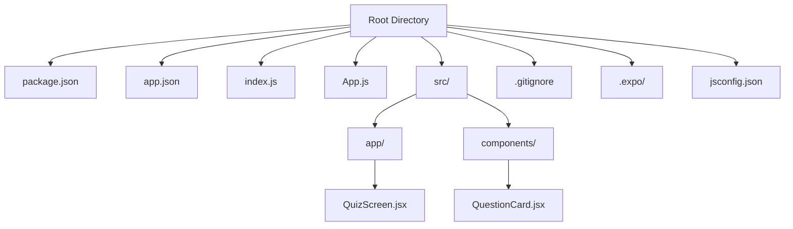
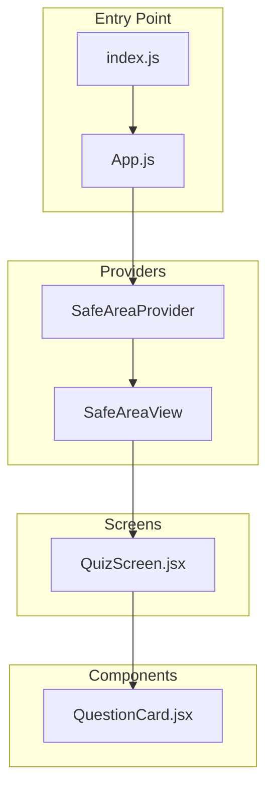
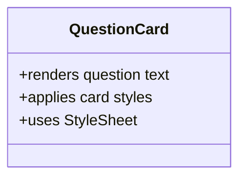
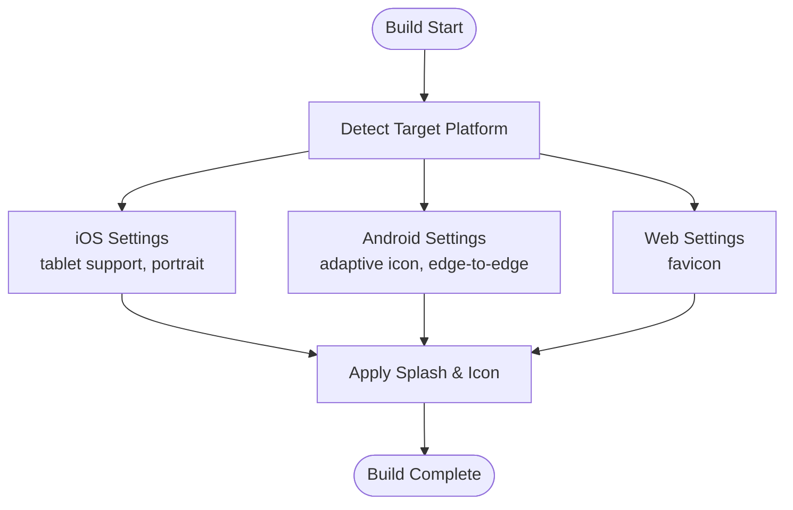
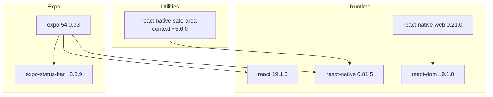

# Project Overview

<cite>
**Referenced Files in This Document**
- [package.json](file://package.json)
- [app.json](file://app.json)
- [index.js](file://index.js)
- [App.js](file://App.js)
- [QuizScreen.jsx](file://src/app/QuizScreen.jsx)
- [QuestionCard.jsx](file://src/components/QuestionCard.jsx)
- [.gitignore](file://.gitignore)
- [.expo/README.md](file://.expo/README.md)
- [jsconfig.json](file://jsconfig.json)
</cite>

## Table of Contents
1. [Introduction](#introduction)
2. [Project Structure](#project-structure)
3. [Core Components](#core-components)
4. [Architecture Overview](#architecture-overview)
5. [Detailed Component Analysis](#detailed-component-analysis)
6. [Dependency Analysis](#dependency-analysis)
7. [Performance Considerations](#performance-considerations)
8. [Troubleshooting Guide](#troubleshooting-guide)
9. [Conclusion](#conclusion)

## Introduction
This document provides a comprehensive overview of the Quiz Mobile App, a cross-platform quiz interface built with React Native and Expo. The project serves as an educational foundation for mobile development, demonstrating a clean, modular architecture that runs seamlessly on iOS, Android, and Web. It emphasizes simplicity and clarity, making it accessible to beginners while offering a solid base for experienced developers to extend and customize.

The application follows React Native best practices, leveraging Expo for rapid development, deployment, and platform parity. Its minimal footprint and straightforward component model highlight the fundamentals of building responsive, cross-platform user interfaces with shared code.

## Project Structure
The project adopts a clear, feature-oriented structure that separates concerns and promotes maintainability:
- Root-level configuration files define dependencies, scripts, and platform settings.
- The App entry point initializes the application shell with safe area support and status bar configuration.
- Modular components encapsulate UI logic, enabling reuse and testability.
- Assets are organized under an assets directory for icons, splash screens, and platform-specific resources.

**Diagram sources**
- [package.json](file://package.json#L1-L22)
- [app.json](file://app.json#L1-L30)
- [index.js](file://index.js#L1-L9)
- [App.js](file://App.js#L1-L31)
- [QuizScreen.jsx](file://src/app/QuizScreen.jsx#L1-L11)
- [QuestionCard.jsx](file://src/components/QuestionCard.jsx#L1-L27)
- [.gitignore](file://.gitignore#L1-L42)
- [.expo/README.md](file://.expo/README.md#L1-L14)
- [jsconfig.json](file://jsconfig.json#L1-L17)

**Section sources**
- [package.json](file://package.json#L1-L22)
- [app.json](file://app.json#L1-L30)
- [index.js](file://index.js#L1-L9)
- [App.js](file://App.js#L1-L31)
- [QuizScreen.jsx](file://src/app/QuizScreen.jsx#L1-L11)
- [QuestionCard.jsx](file://src/components/QuestionCard.jsx#L1-L27)
- [.gitignore](file://.gitignore#L1-L42)
- [.expo/README.md](file://.expo/README.md#L1-L14)
- [jsconfig.json](file://jsconfig.json#L1-L17)

## Core Components
The application’s core is intentionally minimal, focusing on essential building blocks:
- App Shell: Provides the global layout, safe area handling, and status bar configuration.
- Quiz Screen: Hosts the primary quiz interface and orchestrates question presentation.
- Question Card: Encapsulates individual question rendering with styling and typography.

These components demonstrate a layered approach:
- App sets up the environment and global styles.
- QuizScreen manages the quiz container and content layout.
- QuestionCard renders a single question with a clean, reusable design.

Key responsibilities:
- App: Initializes the application shell, integrates safe area providers, and applies global styling.
- QuizScreen: Centers the quiz content and provides spacing for future enhancements.
- QuestionCard: Renders a styled card with question text and maintains consistent visual design.

**Section sources**
- [App.js](file://App.js#L1-L31)
- [QuizScreen.jsx](file://src/app/QuizScreen.jsx#L1-L11)
- [QuestionCard.jsx](file://src/components/QuestionCard.jsx#L1-L27)

## Architecture Overview
The application follows a unidirectional data flow and component composition pattern:
- The entry point registers the root component with Expo.
- App wraps the UI in a provider that manages safe areas and applies global styles.
- QuizScreen composes QuestionCard to present quiz content.
- Platform-specific configurations in app.json enable iOS, Android, and Web builds.

**Diagram sources**
- [index.js](file://index.js#L1-L9)
- [App.js](file://App.js#L1-L31)
- [QuizScreen.jsx](file://src/app/QuizScreen.jsx#L1-L11)
- [QuestionCard.jsx](file://src/components/QuestionCard.jsx#L1-L27)

**Section sources**
- [index.js](file://index.js#L1-L9)
- [App.js](file://App.js#L1-L31)
- [QuizScreen.jsx](file://src/app/QuizScreen.jsx#L1-L11)
- [QuestionCard.jsx](file://src/components/QuestionCard.jsx#L1-L27)

## Detailed Component Analysis

### App Shell Analysis
The App component establishes the foundational UI shell:
- Integrates SafeAreaProvider and SafeAreaView to handle device insets and edge-to-edge layouts.
- Applies a global container style with centered alignment and white background.
- Embeds the QuizScreen and configures the status bar for light-style appearance.

Design philosophy:
- Minimal global styling reduces complexity and improves consistency.
- Safe area providers ensure content adapts to device-specific layouts across platforms.

**Section sources**
- [App.js](file://App.js#L1-L31)

### Quiz Screen Analysis
QuizScreen acts as the primary content container:
- Centers the QuestionCard with padding and background color.
- Provides a flexible layout suitable for future expansion (e.g., navigation, scoring, timers).

Extensibility:
- Easy to add props for quiz state, progress indicators, or action buttons.
- Centralized styling simplifies theme updates.

**Section sources**
- [QuizScreen.jsx](file://src/app/QuizScreen.jsx#L1-L11)

### Question Card Analysis
QuestionCard demonstrates a reusable, self-contained component:
- Renders a question within a styled card featuring padding, rounded corners, and subtle shadows.
- Uses a consistent font size and weight for readability.
- Encapsulates its own styles, promoting isolation and reusability.

**Diagram sources**
- [QuestionCard.jsx](file://src/components/QuestionCard.jsx#L1-L27)

**Section sources**
- [QuestionCard.jsx](file://src/components/QuestionCard.jsx#L1-L27)

### Cross-Platform Build Configuration
app.json defines platform-specific settings:
- iOS: Supports tablet form factors and portrait orientation.
- Android: Configures adaptive icons and edge-to-edge display.
- Web: Sets a favicon for browser environments.
- Splash screen: Defines image, resize mode, and background color.
- New architecture flag enables modern React Native features.

**Diagram sources**
- [app.json](file://app.json#L1-L30)

**Section sources**
- [app.json](file://app.json#L1-L30)

## Dependency Analysis
The project relies on a focused set of dependencies aligned with React Native 0.81.5 and Expo 54.0.33:
- React and React Native: Core framework for cross-platform UI.
- Expo: Development server, build pipeline, and platform APIs.
- react-native-safe-area-context: Handles safe area insets and edge-to-edge layouts.
- react-native-web: Enables Web platform support.
- react-dom: Companion library for Web rendering.
- expo-status-bar: Platform-aware status bar control.

**Diagram sources**
- [package.json](file://package.json#L11-L19)

**Section sources**
- [package.json](file://package.json#L1-L22)

## Performance Considerations
- Component Composition: Keeping components small and focused reduces render overhead and improves maintainability.
- Safe Area Providers: Using SafeAreaProvider ensures optimal layout without manual calculations, minimizing layout thrashing.
- StyleSheet Isolation: Encapsulating styles within components prevents global style conflicts and simplifies maintenance.
- Platform-Specific Optimizations: app.json settings enable edge-to-edge displays and adaptive icons, enhancing user experience without extra runtime logic.

## Troubleshooting Guide
Common setup and runtime issues:
- Metro Bundler Health: Temporary health check files are generated during development and can be safely ignored.
- Expo Environment: The .expo directory stores local development session data and should not be committed.
- Native Build Artifacts: iOS and Android build folders are excluded from version control to prevent platform-specific conflicts.
- TypeScript Build Info: TS build artifacts are excluded to keep the repository clean.

Recommended actions:
- Clear node_modules and reinstall dependencies if encountering build errors.
- Reset Metro cache if the bundler fails to detect changes.
- Verify platform-specific assets (icons, splash images) exist as configured in app.json.

**Section sources**
- [.gitignore](file://.gitignore#L1-L42)
- [.expo/README.md](file://.expo/README.md#L1-L14)

## Conclusion
The Quiz Mobile App exemplifies a clean, educational foundation for cross-platform mobile development with React Native and Expo. Its modular architecture, minimal dependencies, and platform-agnostic design make it an ideal starting point for learning and experimentation. By emphasizing simplicity and clarity, the project encourages developers to build upon its structure while adhering to React Native best practices. Whether you are new to mobile development or seeking a quick baseline for prototyping, this codebase offers a practical and instructive foundation.